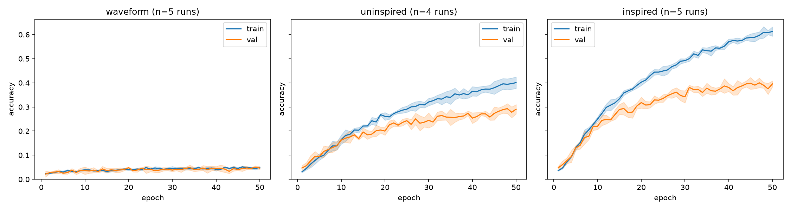

# Multiscale Modeling of Biological Systems: Neuroscience - Assignment

In this assignment you will deploy RSA in the field to compare the alignment of real brain data with different models.

You are provided with three pretrained models (weights in `assignment/models` folder) and some real brain data from the STG, a region in the auditory cortex, that is [believed to represent intermediate acoustic-to-semantic sound representations](https://www.nature.com/articles/s41593-023-01285-9).

The models implement different levels of complexity built towards better emulating how the brain functions. However, their architecture has also been entirely winged and the dataset we used to train it, [ESC-50](https://github.com/karolpiczak/esc-50) is small ($1600$ training samples). You get three pretrained custom models:

| Model | Input | Convolutional | Recurrent | Nonlinearity | Parameters | Motivation |
| --- | --- | --- | --- | --- | --- | --- |
| `WaveformModel` | raw waveform | ✗ | ✗ | Tanh | 8,893,554 | Baseline with no auditory structure assumed, just MLP transformations of the raw signal. |
| `UninspiredModel` | spectrogram | ✓ | ✗ | Tanh | 43,122 | Convolutional filters over frequency and time loosely mirror the tonotopic, spectrotemporal filtering of early auditory cortex. |
| `InspiredModel` | spectrogram | ✓ | ✓ (GRU) | ReLU6 | 203,314 | Adds recurrence to integrate information over time, mirroring downstream auditory regions like STG and ReLU6 caps activation like a biological firing-rate ceiling. |

While the graph below already shows that with added model complexity, we gain improve performance, your task is to figure out whether added complexity made the network align better with the brain, too.

Additionally, you are provided with embeddings extracted from YAMNet, a larger pre-trained audio event classification 
model. It has been shown to align well with the STG data before, and you will compare the models used here to these embeddings, too.

You can download the data and the pretrained models [here](https://filesender.surf.nl/?s=download&token=1518b121-8c37-4e3d-8cf0-2a15717e438c) (they were a bit too big to add to the repo, sorry).

## Code Already Prepared for You

You don't need to build everything from scratch. I prepared several files and functions for you to use.

| File | Description |
| --- | --- |
| **`core.py`** | The main resource for Part I. `SantoroDataset()` loads all the brain-data sounds together with their STG activity. `MODEL_CLASSES` maps each model name to its class, so you can build one directly, e.g. `MODEL_CLASSES["waveform"](num_classes=50)`, when loading a saved checkpoint. `extract_activations(dataloader, model)` runs a model over a set of sounds and hands you back the activations of every trainable layer, one RDM's worth of data per layer. `load_yamnet_activations()` loads the pretrained YAMNet's activations for every layer at once, in the same order as `SantoroDataset()`'s sounds |
| **`models.py`** | The three model classes (`WaveformModel`, `UninspiredModel`, `InspiredModel`). Good reading material if you want to see how they're built, and a good template for your own model in Part II. |
| **`train.py`** | The script that trained the provided checkpoints. |
| **`util.py`** / **`config.py`** | Supporting code that you generally won't need to touch or even open. |

## Assignment Tasks

To complete the assignment, work through the following steps as a guideline.

### Part I: RSA for Model to Brain Analysis

1. Using your own toolboxes from the practical, or `rsatoolbox`, construct RDMs for
   * the STG brain data (in the `data` folder, or just `SantoroDataset()`)
   * each layer of the three provided _untrained_ models (build them with `MODEL_CLASSES`, don't load a checkpoint)
   * each layer of the three provided _trained_ models (build with `MODEL_CLASSES`, then load the weights from `assignment/models`)
   * the embeddings extracted from the pretrained yamnet model given in `data/yamnet_embeddings/` (use `load_yamnet_activations()` to retrieve the activations)
2. Compare the models to the brain data and conduct an analysis on
   * the effect of training on brain alignment, comparing the untrained to the trained models
   * the effect of architectural choices on brain alignment
   * how well layers at different depths of the models align with brain data of the STG
3. Use tSNE or something similar (if you are part of the t-SNE hater club) to visualize how the layers of the models distinguish categories and compare the results to the brain data. `extract_activations` gives you the per-layer activations to feed into `sklearn.manifold.TSNE`.

### Part II: Designing Your Own Model (Bonus)

1. Design your own model of auditory cortex and inspire it with any number of biological details you like as discussed in
the lecture. While you are free in your choices, some recommendations:
   * Do some research on what regions are involved in auditory processing, check the atlas for their connectivity and link them accordingly. This won't be as obvious as you would like it to be, but for the scope of this assignment just make a good effort and report on the procedure and challenges.
   * Build a CRNN, i.e., a Convolutional Recurrent Neural Network, to capture both the tonotopic (implemented through the convolutions) and the recurrent (implemented through ... well, the recurrence) features of auditory cortex. Make some motivated choices as to which regions you implement through what layers.
   * Use `ReLU`s throughout your network. They are both efficient and biologically more plausible than e.g. `tanh` because they have a lower bound at zero, just like biological neurons cannot fire negatively. You may consider using `ReLU6` to additionally model the fact that neurons cannot fire infinitely via an upper bound. Does that make the model align better? I have no idea, but it is worth a try :)
2. Train your model using `train.py`, the script provided with the tutorial (add your model to `MODEL_CLASSES` in `core.py` so the script knows about it. It only needs to take `num_classes` as a constructor argument, like the other three). You can train it using the same ESC-50 dataset used for the other models (download [here](https://github.com/karolpiczak/esc-50)). But there is a good chance that pretraining on a larger dataset with, e.g., an unsupervised objective, and thereafter finetuning on classifying ESC-50, yields better results. 
3. Incorporate this model into your analysis of Part I.

### The Report

Write a ~1500 word (more is fine but please dont overdo it) report on your choices and results. This should at least contain
* A short introduction to the study
  * Data, purpose, models, ...
  * What kind of study type (normative/contrastive/constructive) you conducted here
* Your methods, i.e. mostly how you did the RSA analsis.
  * Also discuss what kind of statistical tests you did to deal with multiple models per model type.
* Your results, i.e. what you found. Reported in figures and tables and summaries thereof.
* Your discussion of the results.
  * What you can learn from the differences in results from untrained and trained models.
  * How the models fared against each other and what the reasons may be.
  * How the model depth played a role in alignment, and what your interpretation is of these results, also comparing amongst the models.
  * And anything else you discover in your analysis.
  * Whether and how the tSNE visualization can help understand the differences in brain alignment of the models.
* A future work section that, based on the lecture material, discusses how more neuroanatomic detail could be injected into the model architecture to improve brain alignment, and what other interventions may push the model to better fit brain data.

## General Remarks

* You should know about statistical testing and confidence intervals. Report your results with confidence bands (or similar) around the mean at all time. If you trained several copies of a model with `--n-models`, `mean_and_ci` in `util.py` is a small ready-made helper for turning a list of values into a mean and a 95% confidence interval.
* The `rsatoolbox` gives you a lot of the statistics for free, but implementing them yourself is a good exercise. We do not expect much complexity here if you implement it yourself, but if you use the `rsatoolbox` we expect you to consult the documentation and describe the statistics you do in the report.
* Do not expect to get high R2 for the models, they are small and you only have brain data on a single participant. Do comparisons between models, rather than focusing on individual R2 values.
* Experiment with different metrics in RSA. You can find some information about them in the [`rsatoolbox` documentation](https://rsatoolbox.readthedocs.io/en/stable/comparing.html)
* Do Part I well. It is the foundation of your assignment and your grade. Part II serves as your opportunity to show off your creativity and skills, and to push towards that holy 10. But Part I suffices to get a very good grade.
* If you are unsure about anything, please reach out (t.weidler@maastrichtuniversity.nl).
* If you find any issues/bugs with the codes here that I missed while testing, please let me know.